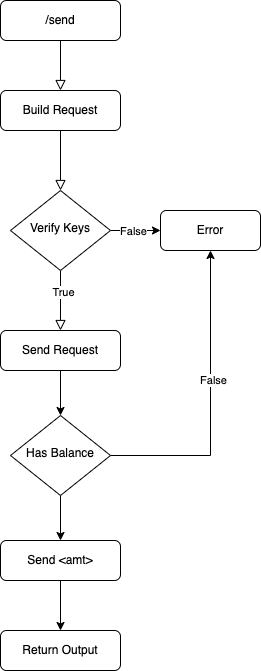
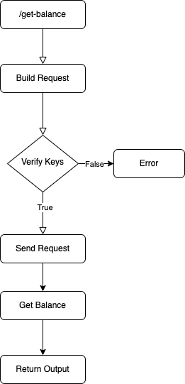

# Introduction
This Springboot backend was written for NUS' assessment. The application exposes the following endpoints:

| Endpoint                          | Parameters                | Type                          |
| -------------                     |:-------------:            |:-------------:                |
| `/accounts/create-account`        | accountId                 | string                        |
| `/accounts/list`                  |                           |                               |
| `/accounts/get-balance`           | accountId                 | string                        |
| `/accounts/send`                  | {to, from, amount}        | {string, string, double}      |


# Getting Started
1. Copy the variables in `application.properties-sample` and paste them into a `application.properties` file, with your own variable values.
2. Run `./mvnw package` to install all components.
3. Run the application using `./mvnw spring-boot:run`.

## Logical Flowcharts
### ```/accounts/send```
<p align="center">
    
</p>
<br>


### ```/accounts/get-balance```
<p align="center">
    
</p>